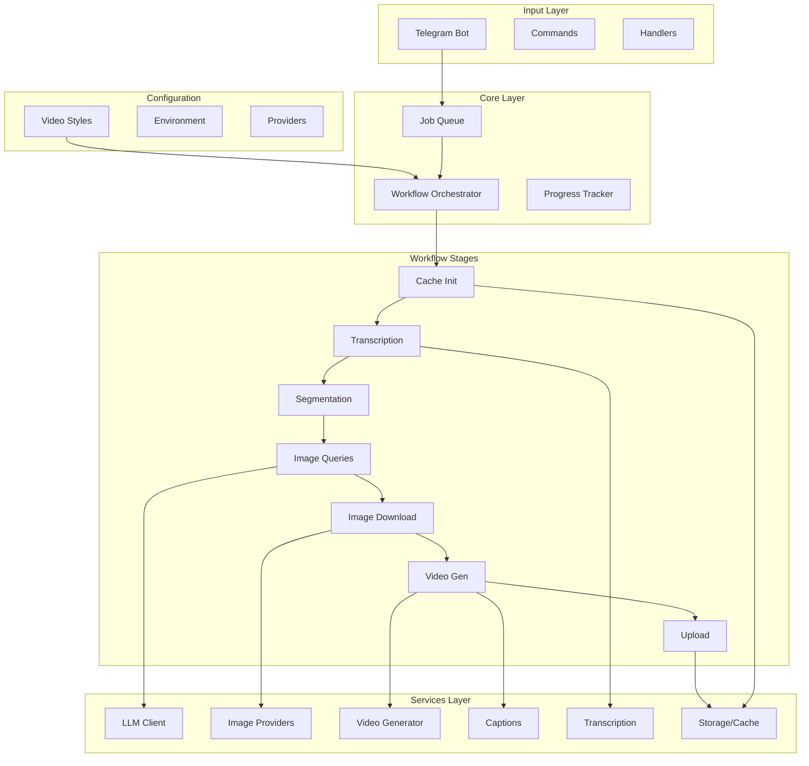

# v2v Architecture Review & Improvement Recommendations

## Executive Summary

The v2v project is a well-structured TypeScript application that converts audio to video using AI-generated visuals. After a comprehensive review, I've identified several areas where the architecture can be improved for better maintainability, scalability, and developer experience.

## Current Architecture Overview



## Strengths of Current Architecture

1. **Clean Separation of Concerns**: Services are well-organized by domain
2. **Pipeline Pattern**: Workflow stages are composable and testable
3. **Caching Strategy**: Multi-level caching (audio, job, segment) with SQLite
4. **Provider Pattern**: Image providers implement a common interface
5. **Type Safety**: Comprehensive TypeScript types throughout
6. **Incremental Processing**: Resume capability for long-running jobs
7. **Retry Logic**: Robust error handling with exponential backoff

## Areas for Improvement

### 1. Dependency Injection & Inversion of Control

**Current Issue**: Services use singleton pattern and direct imports, making testing difficult.

**Example**:
```typescript
// Current - hard to mock
const provider = getProvider();
const result = await provider.generate(options);
```

**Recommendation**: Implement a lightweight DI container or use constructor injection.

```typescript
// Recommended
class ImageDownloadStage {
  constructor(
    private provider: ImageProvider,
    private cache: CacheService,
    private logger: Logger
  ) {}
}
```

### 2. Event-Driven Architecture

**Current Issue**: Workflow stages are tightly coupled through state passing.

**Recommendation**: Introduce an event bus for loose coupling.

```typescript
// Events for better observability and extensibility
eventBus.emit('transcription.completed', { words, duration });
eventBus.emit('image.generated', { segmentIndex, path });
eventBus.emit('video.rendering', { progress: 45 });
```

Benefits:
- Better observability (metrics, logging)
- Plugin architecture (webhooks, notifications)
- Easier testing (event assertions)

### 3. Configuration Management

**Current Issue**: Environment variables scattered across files, no validation at startup.

**Recommendation**: Centralized, validated configuration with schema.

```typescript
// config/schema.ts
const ConfigSchema = z.object({
  telegram: z.object({
    botToken: z.string().min(1),
    allowedUserIds: z.array(z.number()),
  }),
  providers: z.object({
    ai: z.enum(['deepseek', 'kimi', 'gemini']),
    image: z.enum(['cloudflare', 'togetherai', 'imagefx']),
  }),
  // ...
});

// Validate at startup, fail fast
const config = ConfigSchema.parse(process.env);
```

### 4. Error Handling Strategy

**Current Issue**: Error handling is inconsistent - some errors are logged, some thrown, some caught silently.

**Recommendation**: Implement a structured error hierarchy.

```typescript
// errors/index.ts
abstract class V2VError extends Error {
  abstract code: string;
  abstract isRetryable: boolean;
  abstract toUserMessage(): string;
}

class ProviderError extends V2VError {
  code = 'PROVIDER_ERROR';
  isRetryable = true;
  toUserMessage() { return 'Image generation failed, retrying...'; }
}

class SafetyError extends V2VError {
  code = 'SAFETY_VIOLATION';
  isRetryable = false;
  toUserMessage() { return 'Content flagged as unsafe. Try different audio.'; }
}
```

### 5. State Management

**Current Issue**: WorkflowState is a growing monolith with optional fields.

**Recommendation**: Use a state machine pattern with typed transitions.

```typescript
// State machine with typed transitions
type WorkflowState =
  | { status: 'idle' }
  | { status: 'downloading'; filePath: string }
  | { status: 'transcribing'; filePath: string; transcriptId: string }
  | { status: 'generating_images'; queries: ImageQuery[] }
  | { status: 'rendering_video'; images: DownloadedImage[] }
  | { status: 'completed'; result: WorkflowResult }
  | { status: 'failed'; error: V2VError };

// Transitions are type-safe
function transition(
  state: WorkflowState,
  event: WorkflowEvent
): WorkflowState {
  // Compiler ensures all transitions are handled
}
```

### 6. Image Provider Architecture

**Current Issue**: Provider selection is static, fallback order is hardcoded.

**Recommendation**: Dynamic provider registry with health checks.

```typescript
interface ProviderRegistry {
  register(provider: ImageProvider, priority: number): void;
  getHealthyProvider(): ImageProvider;
  markUnhealthy(providerId: string, until: Date): void;
  getHealthStatus(): ProviderHealth[];
}

// Circuit breaker pattern
class CircuitBreaker {
  private failures = 0;
  private state: 'closed' | 'open' | 'half-open' = 'closed';
  
  async execute<T>(fn: () => Promise<T>): Promise<T> {
    if (this.state === 'open') {
      throw new CircuitOpenError();
    }
    try {
      const result = await fn();
      this.onSuccess();
      return result;
    } catch (error) {
      this.onFailure();
      throw error;
    }
  }
}
```

### 7. Queue System

**Current Issue**: In-memory queue is lost on restart, no persistence.

**Recommendation**: Persistent job queue with BullMQ or similar.

```typescript
// Persistent, distributed queue
const videoQueue = new Queue('video-processing', {
  connection: redis,
  defaultJobOptions: {
    attempts: 3,
    backoff: { type: 'exponential', delay: 5000 },
    removeOnComplete: { age: 86400 }, // Keep for 24h
  },
});

// Separate workers can scale independently
const worker = new Worker('video-processing', processor, {
  connection: redis,
  concurrency: 2, // Process 2 videos in parallel
});
```

### 8. Metrics & Observability

**Current Issue**: Limited visibility into system performance.

**Recommendation**: Add structured metrics collection.

```typescript
// metrics/index.ts
interface Metrics {
  // Timing
  transcriptionDuration: Histogram;
  imageGenerationDuration: Histogram;
  videoRenderDuration: Histogram;
  
  // Counts
  videosProcessed: Counter;
  imagesGenerated: Counter;
  providerErrors: Counter;
  
  // Gauges
  queueDepth: Gauge;
  activeJobs: Gauge;
}

// Usage
metrics.transcriptionDuration.observe(duration);
metrics.videosProcessed.inc({ style: 'history' });
```

### 9. Plugin System for Styles

**Current Issue**: Styles are hardcoded, adding new ones requires code changes.

**Recommendation**: Plugin-based style system with JSON/YAML definitions.

```yaml
# styles/history.yaml
id: history
name: History
description: Documentary style with painterly aesthetic

image:
  style: "period-appropriate details, artistic interpretation..."
  negative_prompt: "text, words, letters..."

captions:
  enabled: true
  font: Resolve-Bold
  size: 52
  
effects:
  pan: true
  karaoke: true
```

### 10. API Layer

**Current Issue**: Telegram-only interface limits integrations.

**Recommendation**: REST API layer for broader integrations.

```typescript
// api/server.ts
const app = new Hono();

app.post('/api/v1/videos', async (c) => {
  const job = await videoService.createJob({
    audioUrl: c.body.audioUrl,
    style: c.body.style,
    webhook: c.body.webhookUrl,
  });
  return c.json({ jobId: job.id, status: job.status });
});

app.get('/api/v1/videos/:id', async (c) => {
  const job = await videoService.getJob(c.param.id);
  return c.json(job);
});
```

## Priority Matrix

| Improvement | Impact | Effort | Priority |
|-------------|--------|--------|----------|
| Configuration Schema | High | Low | P1 |
| Error Hierarchy | High | Low | P1 |
| Metrics & Observability | High | Medium | P1 |
| State Machine | High | Medium | P2 |
| DI Container | Medium | Medium | P2 |
| Persistent Queue | High | High | P2 |
| Event Bus | Medium | Medium | P3 |
| Plugin Styles | Medium | Low | P3 |
| Circuit Breaker | Medium | Medium | P3 |
| REST API | Low | High | P4 |

## Immediate Actions (P1)

1. **Add configuration validation** using Zod at startup
2. **Implement structured error hierarchy** for better error handling
3. **Add basic metrics** using a lightweight library like prom-client
4. **Document the retry/safety logic** - it's complex and needs clarity

## Recommended Tech Stack for Improvements

- **Validation**: Zod
- **DI**: TSyringe or inversify
- **Queue**: SQLite-based queue (local, no external dependencies)
- **Metrics**: prom-client
- **Events**: EventEmitter3 or mitt
- **State Machine**: XState
- **API**: Hono or Fastify

### Queue Alternatives (No Redis Required)

Since you want to keep everything local without Redis, here are better options:

**Option 1: SQLite-based Queue (Recommended)**
Leverage your existing SQLite cache database for job persistence:

```typescript
// queue/persistent-queue.ts
interface JobRecord {
  id: string;
  type: 'file' | 'url';
  status: 'pending' | 'processing' | 'completed' | 'failed';
  payload: string; // JSON
  created_at: number;
  started_at?: number;
  completed_at?: number;
  error?: string;
  retry_count: number;
}

class PersistentQueue {
  async enqueue(job: Omit<JobRecord, 'id' | 'status' | 'created_at'>): Promise<string> {
    const id = crypto.randomUUID();
    db.prepare(`
      INSERT INTO job_queue (id, type, status, payload, created_at, retry_count)
      VALUES (?, ?, 'pending', ?, ?, 0)
    `).run(id, job.type, JSON.stringify(job.payload), Date.now());
    return id;
  }

  async dequeue(): Promise<JobRecord | null> {
    // Atomic dequeue using transaction
    const job = db.transaction(() => {
      const next = db.prepare(`
        SELECT * FROM job_queue 
        WHERE status = 'pending' 
        ORDER BY created_at ASC 
        LIMIT 1
      `).get() as JobRecord | undefined;

      if (next) {
        db.prepare(`
          UPDATE job_queue 
          SET status = 'processing', started_at = ? 
          WHERE id = ?
        `).run(Date.now(), next.id);
      }
      return next || null;
    })();

    return job;
  }

  async recoverInterruptedJobs(): Promise<void> {
    // On startup, reset 'processing' jobs back to 'pending'
    db.prepare(`
      UPDATE job_queue 
      SET status = 'pending', started_at = NULL, retry_count = retry_count + 1
      WHERE status = 'processing'
    `).run();
  }
}
```

**Option 2: File-based Queue with Better SQLite**
Use `better-sqlite3` with WAL mode for concurrent access:

```typescript
// Uses existing SQLite setup with proper concurrency
const queueDb = new Database('queue.db');
queueDb.pragma('journal_mode = WAL');
queueDb.pragma('busy_timeout = 5000');
```

**Option 3: Lightweight In-Memory with Persistence**
Keep current in-memory queue but add periodic snapshots:

```typescript
class PersistentInMemoryQueue {
  private queue: Job[] = [];
  private readonly snapshotPath = './data/queue-snapshot.json';

  constructor() {
    this.loadSnapshot();
    // Save every 30 seconds
    setInterval(() => this.saveSnapshot(), 30000);
  }

  private loadSnapshot(): void {
    try {
      const data = readFileSync(this.snapshotPath, 'utf-8');
      this.queue = JSON.parse(data);
      // Reset any 'processing' jobs to 'pending'
      this.queue.forEach(j => {
        if (j.status === 'processing') j.status = 'pending';
      });
    } catch {
      this.queue = [];
    }
  }

  private saveSnapshot(): void {
    writeFileSync(this.snapshotPath, JSON.stringify(this.queue));
  }
}
```

**Recommendation**: Use **Option 1 (SQLite-based)** since you already have SQLite infrastructure. It provides:
- Persistence across restarts
- Atomic operations (no race conditions)
- No additional dependencies
- Works with your existing cache database or separate file
- Supports concurrent readers (WAL mode)

## Conclusion

The current architecture is solid and production-ready. The recommended improvements focus on:

1. **Operational Excellence**: Better observability and error handling
2. **Scalability**: Persistent queues and circuit breakers
3. **Developer Experience**: Type-safe configurations and better testing support
4. **Extensibility**: Plugin system and event-driven architecture

Start with P1 items for immediate value, then progressively adopt P2 and P3 improvements based on operational needs.
